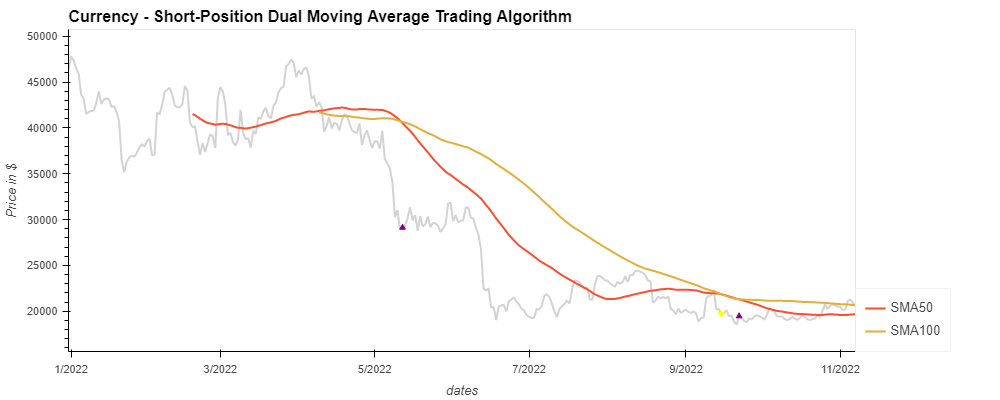
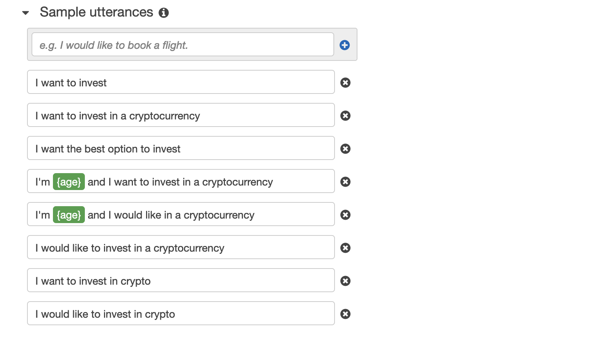
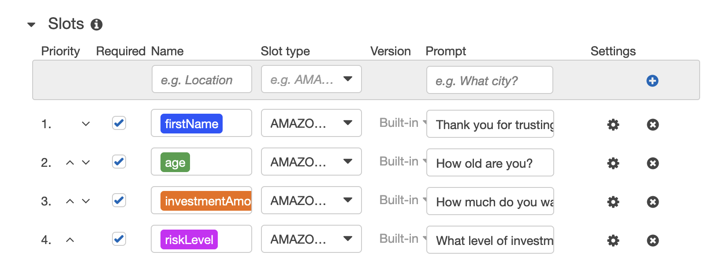

# SAFEHARBOR INVESTMENT CRYPTOCURRENCY INVESTMENT ADVISOR
---

---
### Group_Project_2
Contributors:
Zachary Butler
Katerina Gawthorpe
Nicholas Schulz

### TECHNOLOGY

The applied technologies are Amazon Lex bot and Amazon Lambda function. The used coding languages are Python 3.7 and JSON.

***
## PURPOSE
Several factors play into investing in any asset class.  In comparison, investing in stocks versus cyptocurrency require different approaches because the difference of inherent value.  With regard to investing in stock, an individual would consider the individual companies health by analyzing its financial statements (income, balance sheet, and cash flow statement).  Then, an individual might consider the technical factors related to that company’s stock, such as its historical price performance, returns, and volatility.  All of these factors are affected by the company’s performance, its effectiveness and efficiency of producing a quality product or service to the market.  The relative performance of producing this product or service helps to establish its inherent value.  In contrast, most cyptocurrencies lack the inherent value of producing a proven product or service repeatedly to a market.  They mostly exist through ideas and white papers forged together by like-minded developers and engineers that establish a common goal.  Therefore, the cryptocurrency investing requires greater emphasis on different factors, such as:
•	Projects Website
•	White paper
•	Social Media Channels
•	Project Team and Partnerships
•	Market metrics
o	Market capitalization
o	Trading volume
o	Supply Metrics
•	Price History
•	Utility

Our project primarily focuses on the market metrics, price history, and utility.

## INITIATIVE
***
For our project we developed an investment bot advisor that provides a recommendation for which cryptocurrency to buy based on the investors’ appetite for risk.  We included investment trading algorithm to generate the risk/reward evaluation metrics.  We also included machine learning neural networks to use our historical data to learn the behavior of each coin in the Top 20 in market capitalization.  We also used machine learning to aggregate our coins into groups of risk and to help make predictions that we would become recommendations or investors depending on their risk appetite.  

## Algorithm Trading and Backtesting
If we want the trading algorithm to identify the trading signals that indicate opportunities to buy, we’re looking to identify the times when the short-window SMA is greater than the long-window LMA, as noted in May with the purple upward poiting triangle.

## ROBO ADVISOR

This project creates a robo advisor that suggests the most beneficial cryptocurrency for a client to invest into. The bot is created with help of AWS services.

First, create the robo advisor - the Amazon Lex bot. The Bot name is RoboAdvisor. The intent for this Bot is called recommendPortfolio and the utterances appear as follows:

also define four slots as visible on the next image:

The built robo advisor extended for a Lambda function interacts as following:

---

## LICENSE

MIT

---